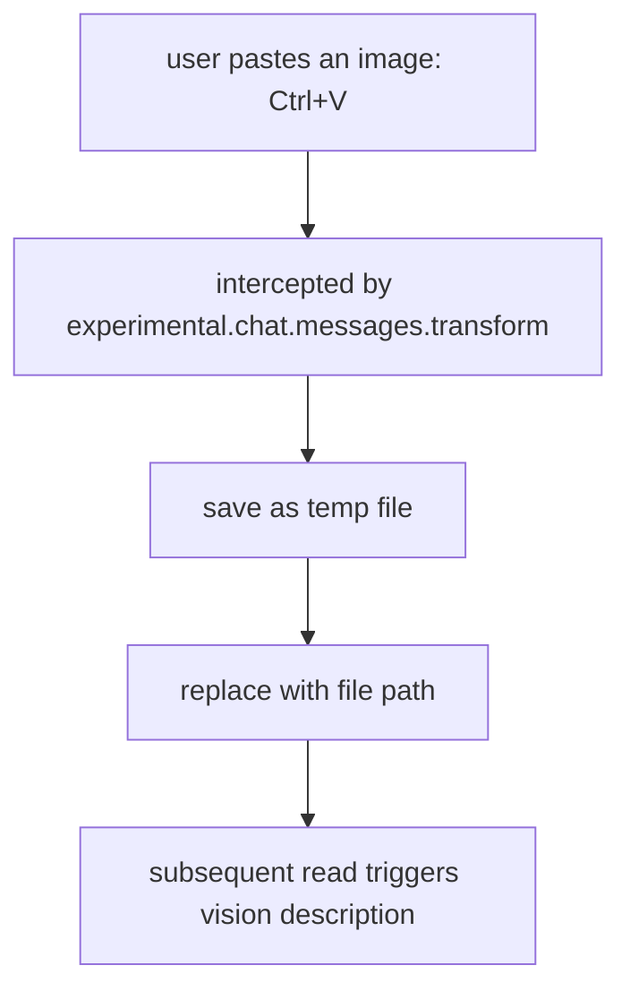

# opencode-image-vision

[](README.zh.md)

Provides image description and OCR text recognition for AI models that do not support image/PDF input, with support for reading images from file paths and the clipboard.

## Features

| Feature | Tool | Description |
| --- | --- | --- |
| **Vision Description** | `read-image` | Image/PDF -> text description (scene, layout, colors) |
| **OCR Text Recognition** | `read-ocr` | Image/PDF -> plain text (accurate text extraction) |

## Installation

```bash
npm install opencode-image-vision
```

Configure in `~/.config/opencode/opencode.json`:

```json
// This is a simplified provider example. See the full examples below.
{
  "plugin": [
    ["opencode-image-vision", {
      "vision": {
        "provider": "custom",
        "model": "Qwen/Qwen3-VL-8B-Instruct",
        "apiKey": "your-key",
        "baseUrl": "https://your-api.com/v1",
        "language": "zh" // Optional: supports "zh" or "en"; default is "zh"
      },
      "ocr": {
        "provider": "custom",
        "model": "deepseek-ai/DeepSeek-OCR",
        "apiKey": "your-key",
        "baseUrl": "https://your-api.com/v1"
      },
      "clipboard": {
        "enabled": true
      }
    }]
  ]
}
```

Copy SKILL.md to the opencode skills directory:

```bash
mkdir -p ~/.config/opencode/skills/read-ocr
cp path/to/opencode-image-vision/skills/read-ocr/SKILL.md ~/.config/opencode/skills/read-ocr/
```

### Vision Provider Configuration Examples

#### Custom (OpenAI-compatible API)

```json
// Example using SiliconFlow API with Qwen3-VL-8B-Instruct
{
  "vision": {
    "provider": "custom",
    "model": "Qwen/Qwen3-VL-8B-Instruct",
    "apiKey": "sk-xxx",
    "baseUrl": "https://api.siliconflow.cn/v1",
    "language": "zh"
  }
}
```

#### OpenAI

```json
{
  "vision": {
    "provider": "openai",
    "model": "gpt-4o",
    "apiKey": "sk-proj-xxx",
    "language": "zh"
  }
}
```

#### Anthropic

```json
{
  "vision": {
    "provider": "anthropic",
    "model": "claude-sonnet-4-20250514",
    "apiKey": "sk-ant-xxx",
    "language": "zh"
  }
}
```

### OCR Provider Configuration Example

OCR only supports `custom` (OpenAI-compatible API), and can connect to any OCR-capable model:

```json
// Example using SiliconFlow API with DeepSeek-OCR
{
  "ocr": {
    "provider": "custom",
    "model": "deepseek-ai/DeepSeek-OCR",
    "apiKey": "sk-xxx",
    "baseUrl": "https://api.siliconflow.cn/v1"
  }
}
```

## Tools

### read-image

Vision description tool that returns a detailed textual description of an image/PDF.

```
read-image(path: "screenshot.png", prompt?: "Please focus on UI elements")
```

### read-ocr

OCR text recognition tool that returns plain text extracted from an image/PDF.

```
read-ocr(path: "document.pdf", language: "zh") // language is optional; supports "zh" or "en"; default is "zh"
```

## Skill

The plugin includes the `read-ocr` skill, guiding the agent to use the OCR tool when vision description is not accurate enough for text extraction.

## How It Works

By using a relatively low-cost vision model, the plugin compensates for models that cannot directly understand image input.

### Vision Description

```mermaid
flowchart TD
  A[agent calls read(image.png)] --> B[intercepted by tool.execute.before]
  B --> C{does the main model support images?}
  C -->|yes| D[skip]
  C -->|no| E{check cache: recognized before?}
  E -->|hit| F[return]
  E -->|miss| G[call vision API]
  G --> H[write temp file with description]
  H --> I[rewrite path to temp file]
```

### OCR

```mermaid
flowchart TD
  A[agent calls read-ocr(image.png)] --> B[call OCR API]
  B --> C[return extracted plain text]
```

### Clipboard



## FAQ

### 401 / Connection error

Check whether `apiKey` is configured correctly, or whether the `apiKeyEnv` environment variable is set.

### First Read Is Slow

Model cold start takes 10-30 seconds; the plugin performs warm-up during initialization.

## [License](./LICENSE)
