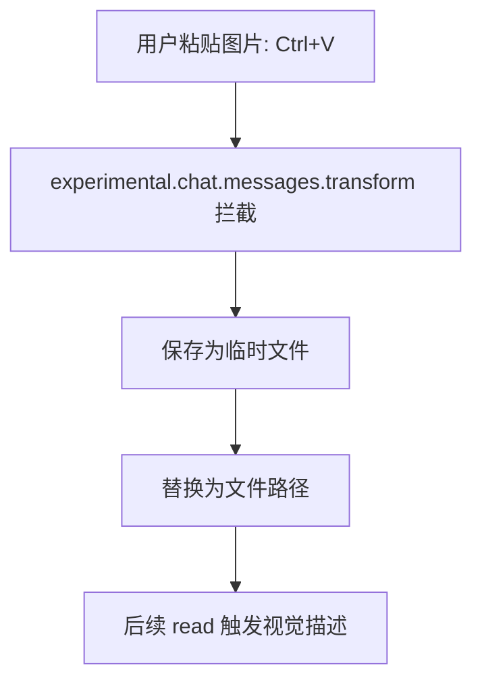

# opencode-image-vision

[](README.md)

为不支持图片/PDF 输入的 AI 模型提供图像描述与OCR 文字识别，支持文件路径读取图片与剪贴板读取图片

## 功能

| 功能 | 工具 | 说明 |
| --- | --- | --- |
| **视觉描述** | `read-image` | 图片/PDF → 文字描述（场景、布局、颜色） |
| **OCR 文字识别** | `read-ocr` | 图片/PDF → 纯文本（精确文字提取）|

## 安装

```bash
npm install opencode-image-vision
```

在 `~/.config/opencode/opencode.json` 中配置：

```json
// 此处简单展示了 provider 配置，完整配置请参考下文示例
{
  "plugin": [
    ["opencode-image-vision", {
      "vision": {
        "provider": "custom",
        "model": "Qwen/Qwen3-VL-8B-Instruct",
        "apiKey": "your-key",
        "baseUrl": "https://your-api.com/v1",
        "language": "zh" // 可选，支持”zh”或“en”，默认为“zh”
      },
      "ocr": {
        "provider": "custom",
        "model": "deepseek-ai/DeepSeek-OCR",
        "apiKey": "your-key",
        "baseUrl": "https://your-api.com/v1"
      },
      "clipboard": {
        "enabled": true
      }
    }]
  ]
}
```

将 SKILL.md 复制到 opencode skills 目录：

```bash
mkdir -p ~/.config/opencode/skills/read-ocr
cp path/to/opencode-image-vision/skills/read-ocr/SKILL.md ~/.config/opencode/skills/read-ocr/
```

### Vision Provider 配置示例

#### Custom（OpenAI 兼容 API）

```json
// 以 SiliconFlow API 为例，连接 Qwen3-VL-8B-Instruct 模型
{
  "vision": {
    "provider": "custom",
    "model": "Qwen/Qwen3-VL-8B-Instruct",
    "apiKey": "sk-xxx",
    "baseUrl": "https://api.siliconflow.cn/v1",
    "language": "zh"
  }
}
```

#### OpenAI

```json
{
  "vision": {
    "provider": "openai",
    "model": "gpt-4o",
    "apiKey": "sk-proj-xxx",
    "language": "zh"
  }
}
```

#### Anthropic

```json
{
  "vision": {
    "provider": "anthropic",
    "model": "claude-sonnet-4-20250514",
    "apiKey": "sk-ant-xxx",
    "language": "zh"
  }
}
```

### OCR Provider 配置示例

OCR 只支持 `custom`（OpenAI 兼容 API），可连接任何支持OCR识别的模型：

```json
// 以 SiliconFlow API 为例，连接 DeepSeek-OCR 模型
{
  "ocr": {
    "provider": "custom",
    "model": "deepseek-ai/DeepSeek-OCR",
    "apiKey": "sk-xxx",
    "baseUrl": "https://api.siliconflow.cn/v1"
  }
}
```

## 工具

### read-image

视觉描述工具，返回图片/PDF 的详细文字描述。

```
read-image(path: "screenshot.png", prompt?: "请关注 UI 元素")
```

### read-ocr

OCR 文字识别工具，返回图片/PDF 中的纯文本。

```
read-ocr(path: "document.pdf", language: "zh") // language 可选，支持”zh”或“en”，默认为“zh”
```

## Skill

插件包含 `read-ocr` Skill，引导 agent 在视觉描述对文字识别效果不好时使用 OCR 工具。

## 运行机制

通过使用较为廉价的视觉描述模型，弥补了不支持图片输入的模型在理解图片内容上的不足。

### 视觉描述

```mermaid
flowchart TD
  A[agent 调用 read(image.png)] --> B[tool.execute.before 拦截]
  B --> C{主模型支持图片?}
  C -->|是| D[跳过]
  C -->|否| E{查缓存: 之前是否已识别}
  E -->|命中| F[返回]
  E -->|未命中| G[调用视觉 API]
  G --> H[写临时文件: 包含描述信息]
  H --> I[改写路径至临时文件]
```

### OCR

```mermaid
flowchart TD
  A[agent 调用 read-ocr(image.png)] --> B[调用 OCR API]
  B --> C[返回提取的纯文本]
```

### 剪贴板



## 常见问题

### 401 / Connection error

检查 `apiKey` 是否正确配置，或 `apiKeyEnv` 环境变量是否设置。

### 首次读取慢

模型冷启动 10-30 秒，插件初始化时会预热。

## [License](./LICENSE)
